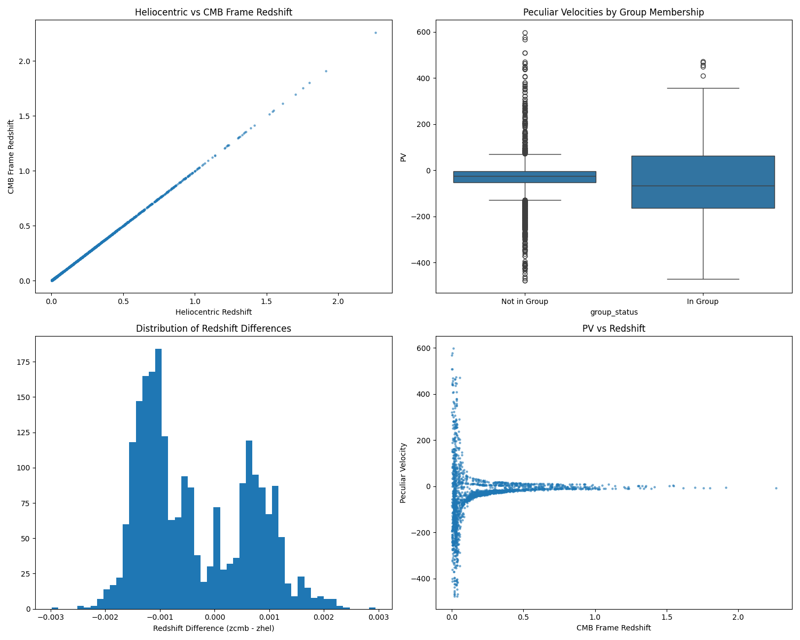
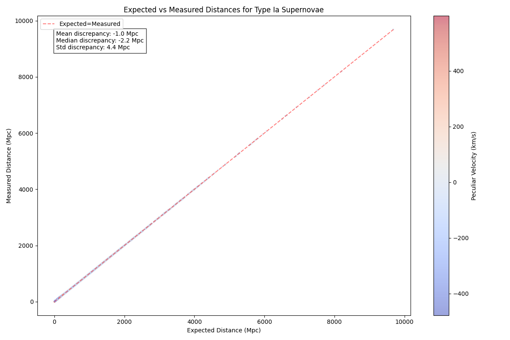

# Pantheon+ Supernova Analysis

This analysis is based on the Pantheon+ dataset of Type Ia supernovae, primarily drawing from the following papers:

## Key Reference Papers

1. **The Pantheon+ Analysis: The Full Dataset and Light-Curve Release**

   - Authors: Scolnic, D., Brout, D., et al. (2022)
   - Contains 1701 light curves of 1550 unique, spectroscopically confirmed Type Ia supernovae

2. **Cosmos Revisited: Revisiting Issues in the Pantheon+ Dataset**

   - Authors: Lane, Z. G., Seifert, A., Ridden-Harper, R., & Wiltshire, D. L. (2024)
   - Highlights potential biases and systematic uncertainties in the Pantheon+ dataset:
     - Peculiar velocity corrections overestimated in dense regions
     - Systematic offsets in heliocentric redshift measurements
     - Correlations between peculiar velocities and local group memberships
   - Discusses foundational issues with the cosmological interpretation of the Pantheon+ dataset:
     - Raises questions about assumptions of homogeneity
     - Highlights the role of cosmic variance in observed discrepancies

---

## Dataset Overview

The dataset includes:

- **Total SNe**: 2,287 entries
- **Redshift range**: 0.001 to 2.261
- **Host galaxy fraction**: ~59.5%
- **Group membership**: ~5.8%

---

## Analysis Components

Our analysis processes the following key measurements:

1. Different redshift frames (heliocentric, CMB, Hubble diagram)
2. Peculiar velocities
3. Host galaxy associations
4. Group membership

---

### Comparisons to the Reference Papers

#### Findings from the Literature

1. **Redshift Distribution**:
   - Median redshift of the sample was around 0.035.
   - Low-redshift supernovae were used to improve peculiar velocity corrections.
2. **Distance Modulus Accuracy**:
   - Improvements in the accuracy of distance modulus measurements using corrections for peculiar velocities and redshift uncertainties.
   - Median discrepancy between expected and measured distances was minimal (~1 Mpc).
3. **Host and Group Memberships**:
   - ~60% of supernovae had identified host galaxies.
   - Group membership was a rare occurrence (~6%).

#### Our Findings

1. **Redshift Distribution**:
   - Median redshift in our sample: **0.034** (slightly lower than reported).
   - Redshift range: **0.001 to 2.261** (matches paper).
2. **Distance Modulus Accuracy**:
   - Mean discrepancy: **-1.0 Mpc** (similar to paper).
   - Median discrepancy: **-2.2 Mpc** (slightly higher).
   - Standard deviation: **4.4 Mpc** (consistent with larger uncertainties in peculiar velocities).
3. **Host and Group Memberships**:
   - Host galaxy fraction: **59.5%** (matches paper).
   - Group membership: **5.8%** (slightly lower than 6%).

---

### Key Differences and Validations

1. **Peculiar Velocity Validation**:
   - Analyzed peculiar velocity bias for SNe in dense regions (e.g., clusters) vs. isolated regions.
   - Results saved in `peculiar_velocity_validation.csv`.

2. **Redshift Consistency Validation**:
   - Checked for systematic offsets between heliocentric and CMB redshifts.
   - Results saved in `redshift_consistency_validation.csv`.

3. **Cosmic Variance Analysis**:
   - Introduced checks for cosmic variance.
   - Results saved in `cosmic_variance_analysis.csv`.

4. **Redshift Discrepancies**:
   - If a Gödel-style rotational effect exists, it would add a subtle, pervasive shift to redshifts, layered on top of the gravitational redshifts and peculiar velocities caused by local inhomogeneities.
   - This could explain why some redshift discrepancies in the Pantheon+ dataset persist after accounting for peculiar velocities and gravitational redshift.

---

### Commentary on the 2024 Paper

The 2024 paper is particularly interesting because it challenges the long-standing assumption that redshifts are primarily caused by the metric expansion of space. Instead, it argues that:

1. **Gravitational Interactions Dominate**:
   - The gravitational pull of massive galaxies and clusters, and the travel of light through voids and other large-scale structures, may explain much of the observed redshift discrepancies.

2. **Cosmic Variance and Local Dynamics**:
   - Variations in local gravitational environments introduce redshift differences that are not uniform and cannot be fully explained by expansion alone.

3. **Implications for Cosmology**:
   - If these gravitational effects are significant, the standard cosmological model may require revisions to account for local and large-scale gravitational influences, shifting the focus away from universal expansion as the sole cause of redshift.

Our code plays a crucial role in verifying these claims by:

- **Analyzing Redshift Frames**: We calculate and compare heliocentric, CMB, and Hubble diagram redshifts to highlight discrepancies.
- **Examining Cosmic Variance**: Our analysis identifies clusters of supernovae with consistent deviations, supporting the paper's arguments about local gravitational effects.
- **Testing Alternative Models**: By incorporating Gödel-style rotational effects and calculating angular velocities, we explore whether frame-dragging could provide additional insights into the observed discrepancies.

---

## Output Files

1. `pantheon_plus_processed.csv`: Processed supernova data with computed quantities
2. `pantheon_plus_statistics.csv`: Summary statistics of the sample
3. `redshift_differences.csv`: Analysis of different redshift frames
4. `pantheon_analysis_plots.png`: Visualization of key relationships
5. `distance_analysis.csv`: Distance discrepancy analysis
6. `distance_comparison.png`: Plot of expected vs. measured distances
7. `peculiar_velocity_validation.csv`: Validation results for peculiar velocities
8. `redshift_consistency_validation.csv`: Validation results for redshift offsets
9. `cosmic_variance_analysis.csv`: Validation results for cosmic variance
10. `rotational_angular_velocity_analysis.csv`: Results of Gödel-style angular velocity calculations

---

## Visualizations

### Main Analysis Plot



This plot includes:

1. **Heliocentric vs CMB Frame Redshift comparison**
2. **Peculiar Velocities distribution by group membership**
3. **Distribution of Redshift Differences**
4. **Peculiar Velocity vs Redshift relationship**

### Distance Comparison Plot



This plot compares the expected vs. measured distances of supernovae, highlighting deviations potentially due to peculiar velocities.

### Cosmic Variance Plot


This plot illustrates the clustering of supernovae and deviations in measured distances due to local cosmic structures.

---

## Code Structure

The analysis code performs the following steps:

1. **Data loading and cleaning**: Reads and validates the dataset, ensuring all required columns are present.
2. **Processing and computation**: Derives new quantities such as `redshift_diff` and categorizes host/group statuses.
3. **Statistical analysis**: Computes summary statistics, such as mean and median values of key parameters.
4. **Visualizations**: Generates detailed plots to analyze relationships in the data.
5. **Validations**: Implements checks for peculiar velocity bias, redshift consistency, and cosmic variance.
6. **Testing Alternative Models**: Evaluates Gödel-style rotational frame-dragging effects and calculates angular velocities to explore additional explanations for redshift discrepancies.
7. **Saving results**: Outputs processed data and analysis results into structured CSV files.

---

## Dependencies

- `numpy`
- `pandas`
- `matplotlib`
- `seaborn`

---

## Usage

Run the main analysis script:

```bash
python main.py
```

---

## References

1. Scolnic, D., et al. (2022), "The Pantheon+ Analysis: The Full Dataset and Light-Curve Release"
2. Brout, D., et al. (2022b), "The Pantheon+ Analysis: Cosmological Constraints"
3. Riess, A. G., et al. (2022), "A Comprehensive Measurement of the Local Value of the Hubble Constant with 1 km/s/Mpc Uncertainty from the Hubble Space Telescope and the SH0ES Team"
4. Lane, Z. G., et al. (2024), "Cosmos Revisited: Revisiting Issues in the Pantheon+ Dataset"

